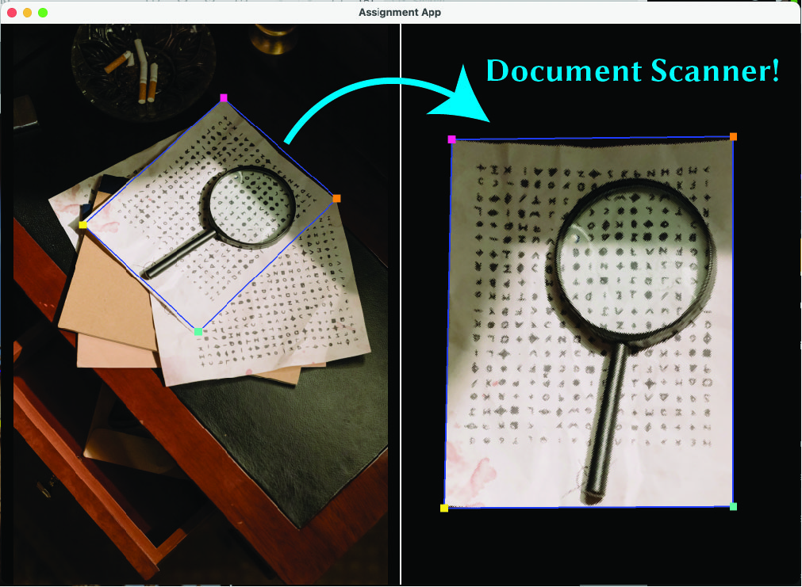
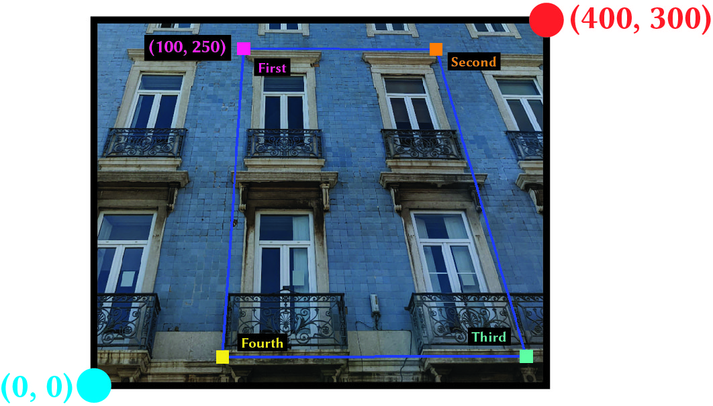
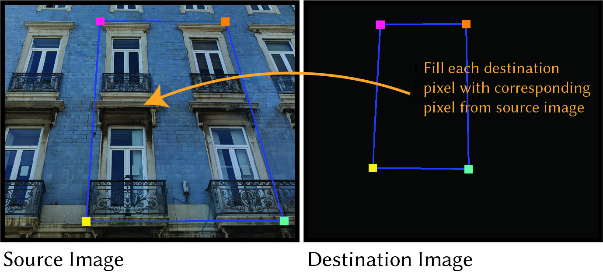
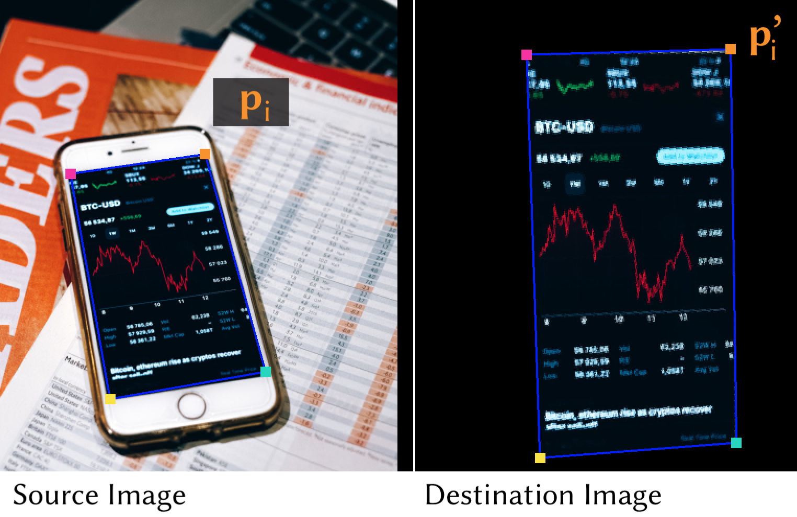

# Assignment 1: Homographies

In this assignment you will implement and experiment with a document scanner tool that can let you
unwarp images based on keypoints. The functionality is similar to that of Microsoft's [Office Lens](https://apps.microsoft.com/store/detail/office-lens/9WZDNCRFJ3T8?hl=en-us&gl=us) or [Adobe Scan](https://apps.apple.com/ca/app/adobe-scan-pdf-scanner-ocr/id1199564834). This tool is based on [homographies](https://en.wikipedia.org/wiki/Homography_(computer_vision)), which is a matrix transform that relates two planar surfaces in space as discussed in Lectures 1 and 2. Your specific task is to complete the technique's implementation in the starter code. The code has an optional app that you can use to test your algorithm and play around with the document scanner interactively.



**Goals:** The goals of this assignment are to (1) get you familiar with working with images, Python,
and NumPy; (2) learn how to implement basic geometrical operations like transformations and mapping;
and (3) learn some insights of what kind of difficulties arise when you geometrically manipulate images.

**Bonus:** This assignment expects that you implement the transformations in the most naive way possible
using for loops; there are ways to implement it *much* faster by taking advantage of NumPy and vectorization.

**Important:** You should start by getting a high level idea of what the code does by attending tutorial (hopefully you went!). Then, try to run the reference solution by following the instructions in the [section below](#running-the-reference-solution). Once you get the high level idea of what the code does, take a look at `app/a1/a1_headless.py` (where the app is implemented) and `viscomp/algos/a1.py` (what you need to complete) to understand the overall flow of things. Everything you need to implement is in `viscomp/algos/a1.py`. You do not need to make any other changes.

**What you should not do:** You may not rely on OpenCV or any external computer vision or image processing
library to implement the assignment. You should be able to implement everything just purely with NumPy and
Python.

**Testing your implementation:** Your implementation will be tested on the teaching labs Linux machines,
by running `app/a1/a1_tests.py`. Make sure you can run these tests by following the [instructions below](#running-on-all-provided-sample-images) and check that your output looks fine.

## Starter code & the reference solution

Once you download the reference solution from Dropbox, use these commands to unpack:

```
tar xvfz homography.tar.gz
rm homography.tar.gz
cd CSC320/viscomp/
```

### Tour of codebase

#### Assignment implementation for students

`viscomp/algos/a1.py` contains the meat of the assignments that you will be implementing. This is the **only** file you  will need to modify for your assignment.

#### Scripts for executing implementation

`app/a1/a1_app.py` contains code for launching interactive app. See [section below](#running-the-interactive-app) for running instructions.

`app/a1/a1_headless.py` contains code for running homography and warping in a headless way. See [section below](#running-the-reference-solution) for running instructions.

`app/a1/a1_tests.py` contains code for running batch of tests on teaching lab machines. See [section below](#running-on-all-provided-sample-images) for running instructions.

#### Reference solution images and 2D coordinates for testing

`app/a1/data/pexels-publicdomain/` contains images for reference solutions.

`app/a1/tests/` contains `.csv` files of four distinct 2D coordinate pairs for each image in `data/pexels-publicdomain/` 

### Running the reference solution

On the teaching labs Linux machines, you can then run the reference solutions with:

```
cd app/a1
python a1_headless.py --image-path data/pexels-publicdomain/building1.jpg \
                      --source-path tests/building1_source.csv \
                      --destination-path tests/building1_destination.csv \
                      --output-path results/building1 \
		      --reference-solution 
```

This will output an file called `building1_output.png` to `results`. This image should be more or less
identical to the image located in `reference_results/building1_output.png`.

### A closer look at the code for running the reference solution

First, the code takes in an input image, which you specify with the command line (CLI) argument `--image-path`. The image should be a `.jpg` or `.png`. Next, we pass in two `.csv`  files labelled with the arguments `--source-path` and `--destination-path`. The two `.csv` files contain the four distinct 2D coordinates that define a (convex) quadrilateral (a convex 4-sided polygon).

-   The `--source-path` input defines a quadrilateral on the input image, in integer pixel coordinates where `0, 0` is the bottom left corner of the image, and `height, width` is the top right corner of the image.

-   The `--destination-path` defines a quadrilateral on an **empty** image, also in integer pixel coordinates space.

These two quadrilaterals define 2 planes, for which their geometrical relationship is defined via the [homography matrix](https://en.wikipedia.org/wiki/Homography_(computer_vision)).

>   **Important:** The 2D coordinates are in the order of: top left, top right, bottom right, bottom left. In other words, they are in **clockwise** order. See the image below for an example.



The goal of the *algorithm* that you will be implementing in this assignment is to find a way to take that
empty quadrilateral (the *destination* quadrilateral), and fill it in with the contents in the quadrilateral
on the input image (the *source* quadrilateral).



Please read the checklist in `app/a1/CHECKLIST.txt` carefully. It includes details on the distribution
of marks in the assignment. You will need to complete this form prior to submission, and it will be the
first file TAs look at when marking your assignment.

### Running the interactive app

You can invoke an interactive app in which you will be able to interactively click on corners of your quadrilateral in clockwise order to run the algorithm. This app can also be useful for debugging your algorithm, since you'll get much more immediate feedback. It can be launched on your personal machines.

To run the interactive app on one of the provided reference images:

```
python a1_app.py --input-image data/pexels-publicdomain/tokyo0.jpg
```

Note that you have be in the `app/a1` folder to run this command.

### Running on all provided sample images

In addition to `app/a1/a1_headless.py` which runs the algorithm on the specified input and `app/a1/a1_app.py`which launches the interactive app, we provide the option to run the algorithm on all provided sample images:

```
python a1_tests.py
```

This is a nice way to run your algorithm implementation on the batch of reference inputs. You can use this make sure all the outputs look good! Note that you have be in the `app/a1` folder to run this command.

**Other useful tips:** Use a debugger! You can easily debug Python code by injecting `import pdb; pdb.set_trace()`
wherever you want a breakpoint to enter the interactive Python REPL to print variables and run code.

## Part A: Homography Algorithm (85 Marks)

In this section, you will implement the two algorithms:

1. **Homography Matrix Calculation**: Calculating a homography matrix from 2 quadrilaterals.

2. **Backward Mapping**: Looping through every destination pixel and using the homography to find the corresponding source pixel.

Both of these functions and their skeletons can be found in `viscomp/algos/a1.py`. Your implementation
will wholly reside in this file. You will not need to make modification to anything else in the codebase.

### Part A.1: Homography Matrix Calculation: The `calculate_homography()` function (45 marks)

We can estimate a homography $H$ given sufficiently many point correspondences. Usually, many correspondences are used to compute $H$. However, for this assignment, we will use the minimum number of correspondences needed for a unique solution: **four**, under the condition that the four points are distinct, and define a (convex) quadrilateral. You will be implementing the code for determining $H$ in `calculate_homography()`.

Let's start by writing down the equations for a single point $p_i$ in the source image and its correspondence $ p_i'$ in the destination image, shown in the figure below:



Points $p_i$ and $p'_i$ have coordinates that are known, either provided by the values in the `.csv` files for the reference solution or extracted from the user's clicks in the interactive app. We can write them as:

$$
p_i = \left[\begin{array}{l}
x_i \\
y_i \\
1
\end{array}\right],  \quad
p'_i = \left[\begin{array}{l}
x_i' \\
y_i '\\
1
\end{array}\right]
$$

and are related by the unknown homography matrix $H$

$$
H = \left[\begin{array}{lll}
a & b & c \\
d & e & f \\
h & k & 1
\end{array}\right]
$$

such that $p'_i = Hp_i$. The eight values $a, b, c, d, e, f, h, k$ are unknown and are what we want to solve for. For our point $p_i$, if we were to perform the multiplication $p'_i = Hp_i$, we would find

$$
\left[\begin{array}{c}
x^{\prime}_i \\
y^{\prime}_i \\
1
\end{array}\right]=\left[\begin{array}{c}
\left(a x_i+b y_i+c\right) /\left(h x_i+k y_i+1\right) \\
\left(d x_i+e y_i+f\right) /\left(h x_i+k y_i+1\right) \\
1
\end{array}\right]
$$

Therefore, we find that that one point correspondence $p_i$ and $p_i'$ can give us two equations. Four point correspondences will then provide us with eight equations, exactly what we need for our eight unknowns.

Thus, your work for `calculate_homography()` is to take in as input:

-   `source`: an `np.ndarray` of size 4x2 containing the 2D coordinates ($x_i, y_i$) of 4 points $p_i$ in the source image
-   `destination`: an `np.ndarray` of size 4x2 containing the 2D coordinates ($x'_i, y'_i$) of 4 points $p'_i$ in the destination image

And return as output the 3x3 homography matrix $H$ by solving for $a, b, c, d, e, f, h, k$.

### Part A.2: Backward Mapping: The `backward_mapping()` function (40 marks)

Now that we have our homography matrix $H$, we can apply it to portion of the source image in the convex region outlined by the four source correspondence points. This is the task for `backward_mapping()`, where you will pass in as input

-   `transform`: your 3x3 homography matrix solved for in `calculate_homography`
-   `source_image`: the H_s x W_s x 4 image that is used as the source to read from.
-   `destination_image`: the H_d x W_d x 4 image that is used as the destination to write to.
-   `destination_coords`: the 2D locations of the 4 corners on the destination.

And, return the **normalized** result, which is the backward mapped image. This task will require looping through every destination pixel, finding which points are inside the convex polygon, and using the homography $H$ to find the corresponding source pixel. Make sure to check your matrix dimensions when implementing the multiplication!

**Bonus:** While this assignment expects that you implement the transformations in the most naive way possible
using for loops, there are ways to implement it *much* faster by taking advantage of NumPy and vectorization.

## Part B: Experimentation (15 Marks)

### Part B.1: Trying it on your own data! (5 Marks)

Your task is to run the algorithm on your _own_ data. Specifically:

1. Take your own picture using a smartphone camera or equivalent of some document with interesting patterns,
  at an oblique angle (meaning the document should not be perpendicular to your line of sight).

2. Resize these images to something reasonable, like 720px on one side of the image. Save this to `app/a1/report/image.jpg`.

3. Using some image viewing tool (like Preview on OSX or Gimp on Linux) to find 4 corners (remember the order!)
  of the quadrilateral on the image. The output quadrilateral should be a simple rectangle of some sort.
  Save these as `app/a1/report/image_source.csv` and `app/a1/report/image_destination.csv`.

4. Use `app/a1/a1_headless.py` to run your algorithm using these as input images. Save the output as `app/a1/report/output.jpg`.

### Part B.2: Write a lab report!

Your report should include the following: (1) your name, student number, and student username;
(2) images of the input and results; (3) a qualitative description of the results (What artifacts do you see and what causes them? What limitations are there to the algorithm? Try to be as analytic as possible!); (4) your ideas about
how you might improve the results.

Place your report as a file `app/a1/report/report.pdf` (**Important:** Save this as a PDF, **not** `.docx` or other!).

## What to turn in

You will be submitting the completed CHECKLIST form, your code, your written report and images. Use the following
sequence of commands to pack everything up:

```
cd CSC320
tar cvfz assign1.tar.gz viscomp
```

**Important:** Make sure to unpack to check that you actually have your reports and everything in there!
