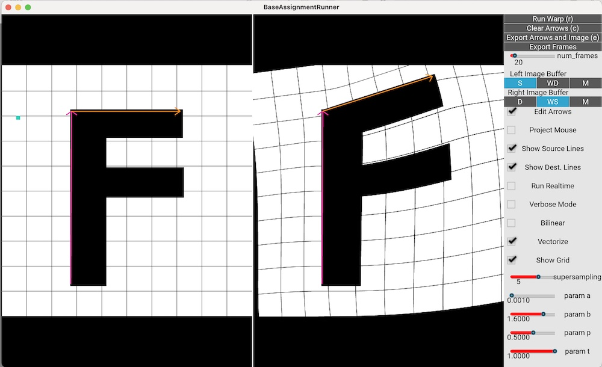
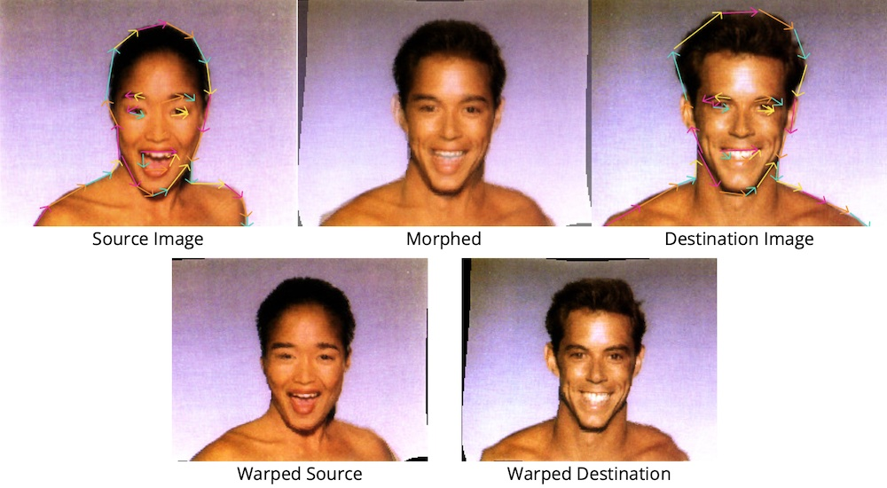

# Assignment 2: Morphing



In this assignment you will implement and experiment tool that can let you 
morph images based on lines. This tool is based on the [Beier-Neely algorithm](https://www.cs.princeton.edu/courses/archive/fall00/cs426/papers/beier92.pdf)
which you will implement. Your specific task is to complete the technique's implementation in the starter code.

## Starter code & the reference solution

Once you download the reference solution from Dropbox, use these commands to unpack:

```
tar xvfz morphing.tar.gz
rm morphing.tar.gz
cd morphing
```

### Implementation Notes

`viscomp/algos/a2.py` contains the part of the assignment that you will be implementing. This is the **only** file you  will need to modify for your assignment.

#### Top-level execution scripts

`a2_app.py` contains code for launching interactive app. See [section below](#running-the-interactive-app) for running instructions.

`a2_headless.py` contains code for running the morphing and field-warping algorithm from the command line, without the UI.

`a2_tests.py` contains code for testing your implementation.

#### Important python files

You should read and understand the following three files, in this order:

1. `app/a2/a2_headless.py`  contains code for running the morphing app without an interactive interface.
2. `viscomp/algos/a2.py`  contains all of the starter code you will need to complete
3. `viscomp/ops/image.py` contains useful helper routines

If you are interested in finding out more about how the interactive app works, you can optinally look at  `app/a2/a2_app.py`:

1. `render()` contains the main loop that the app runs for every warp/morph.
2. `on_mouse_press()` controls the UI's behaviour when you click on the screen.

####Debugging tips###

1. Use the `app/a2/data/f/f_lowres.png` file to test your code! This is a super simple, low-resolution image that will run fast with your code. You can also see the pixels individually, which will make debugging and reasoning about your code easier. 
2. Use debugging command-line arguments such as `--verbose` (will print useful mouse location information when you click on the screen so you can learn about the coordinate system), `--debug-grid` (will draw a grid on the source and destination images so you can look at the warping field more intuitively) and `--show-warped-cursor` (will warp the cursor location to the corresponding warped image and show you the coordinates) 
3. You can get a full list of command line arguments with `-- --help`. If you are using the interactive UI, you must use `--` as the first command-line argument, ie. before any other arguments you need to pass to the app.

#### Additional implementation-related notes

Reading this is **optional** but will definitely help you get a full understanding of the code.

* `a2_headless.py` includes
a very bare bones implementation of everything without the complexities of making an 
interactive app. The structure of `app/a2/a2_headless.py` is very simple: first, there is some
boiler plate code to load in command line arguments. Then, the source and (optionally) the
destination images are loaded in. Then, the source and (optionally) the destination lines
are loaded in. Then, these are all fed into `viscomp.algos.run_a2_algo` to run the morphing
algorithm and outputs the results. 

* Your implementation resides in `viscomp/algos/a2.py`, which is where 
`viscomp.algos.run_a2_algo` comes from. In the code, code blocks are clearly marked
where you will need to put your own code. When you implement these functions, you should
take a look at helper functions in `viscomp/ops/image.py` which contains functions for 
working with coordinate systems that will come very handy. These also have input and output 
signatures. Always be aware of the
input and output and verify that your input and output follows the correct structure!
Python doesn't do any type checking and most bugs we see with implementations come from
bugs in the input specification like having the wrong shape. Particularly for numpy arrays,
use things like `print(arr.shape)` to debug your code! When in doubt, insert a breakpoint
to debug by using things like `import pdb; pdb.set_trace()`!

* `app/a2/a2_app.py` contains the core UI implementation. The app is implemented using `Kivy` as
a backend, which is a GUI framework which helps us make things interactive. The "base class"
for the app is contained in `app/a2/base_app.py`. Most of the code in this `base_app.py` is 
not important for the specific assignment; it is code that defines the GUI, remaps GUI interactions like
mouse clicks to something `a2_app.py` supports, functions to do rasterization, etc. 

* If you want to dig a bit deeper, look at function 
`render()` inside `app/a2/a2_app.py`. This is a function that gets called every frame that the app runs. This function
will first determine if there are any *complete* lines drawn on the screen. If there are,
it will prepare the `source_morph_lines` and `destination_morph_lines` which are data structures
which hold the lines drawn on the screen as inputs for `algos.run_a2_algo`. Then, it will take
the outputs of `algos.run_a2_algo` and write them to the appropriate buffers (`self.warped_source`, 
`self.warped_destination`, and `self.morphed_image`). Then, according to the selections on the
GUI, the appropriate buffers will be drawn out to the app (all this happens in `update_buffer()`).
There are later some more processing that happens, like the code to optionally project the mouse
cursor onto other buffers, and drawing raster primitives (like the mouse cursor, arrows, etc) onto
the screen.

* If you are intereted in how the mouse controls are implemented, look at function `on_mouse_press(x, y, button)` `app/a2/a2_app.py`. 
Specifically, the mouse
information is saved in `self.mouse_location_int` for pixel coordinates and `self.mouse_location`
for normalized `[-1, 1]` coordinates. There are also coordinate systems for the images drawn
on the screen themselves and not just the canvas, which are stored in `self.mouse_image_location`
and `self.mouse_image_location_int`. All this information is used to draw new lines onto the 
screen by updating `self.source_morph_lines` and `self.destination_morph_lines`. All of these
coordinate systems may be a little confusing, but if you are in `--verbose` mode which you can
enable by clicking the checkbox on the GUI or passing in the command line argument, then 
every time you click on somewhere on the canvas, it will output to the terminal all of the 
different coordinates (in pixel coordinates, in float coordinates, in image space coordinates, etc)
onto the screen. It would be useful to click on different parts of the image to get a sense of the
coordinate system; this will come in handy when implementing things like interpolation!

## Installation

Even if you did this installation before, you will have to run `pip install -r requirements.txt` again.
On OSX machines with the new M1 / M2 ARM chips, you may need to create a new environment with Python 3.9
for the reference solution to work.

Create a conda environment:
```
conda create -n viscomp python=3.9
conda activate viscomp
pip install --upgrade pip
```

Install requirements:
```
pip install -r requirements.txt
```

Install `viscomp`:
```
python setup.py develop
```

## Running the Interactive App with the Reference Solution

In this assignment, we have shipped the binaries of the reference implementation for the app
alongside the starter code. 

### Running with a Single Image

To run the morphing app with the reference solutions, run:

```
cd app/a2
python a2_app.py -- --source-image-path data/f/f.png --vectorize --reference-solution
```

**Note:** Don't forget the `--` in the command! This is a Kivy thing.

To see all the command line arguments, run
```
python a2_app.py -- --help
```

Once you are in the app, you will see a screen with an "F" on the left side of the screen 
(the **source buffer**) and a 
blank screen on the right side of the screen (the **destination buffer**). 
To run the reference solution, start by drawing an
arrow on the screen with your mouse by clicking on the image. Once you draw at least one arrow,
click on the `r` key or the `Run` button on the GUI. The right hand side of the screen, the exact
same "F" should show up.

To perform morphing, click on the `Edit Arrows` checkbox on the GUI, and drag the arrow around. 
As your slowly move the arrows around, click `Run` to get an intuitive sense of how the morphing works!
If you want an even more interactive experience, click on the `Run Realtime` checkbox to run the algorithm
at 30 FPS. Note that this `Run Realtime` only works for fast implementations, like the one in the solution
with the `Vectorize` checkbox turned on.

You can also check how each destination pixel gets mapped to the source pixel by turning on the `Project Mouse`
checkbox. This mode will have the mouse cursor be projected onto the source image from the destination image
and vice a versa.

Another important GUI element is the radio buttons under `Left Image Buffer` and `Right Image Buffer`.
The letters here corresponds to `S = Source`, `WD = Warped Destination`, `D = Destination`, `WS = Warped Source`
and `M = Morphed`. The `WD`, `D` and `M` options only are useful when you pass in a destination image, 
which we will explain later.

Lastly, you can use `Export Arrow and Images` to export the arrows you drew on the screen as `.csv` files
you can load in with command line options `--source-line-path` and `--destination-line-path`. By default
they are saved to the `results` directory but you can adjust this with `--output-path`. If you click 
on `Export Frames`, this will create multiple frames where the `param t` is animated to create a video
of the morphing slowly progressing.

### Running with Multiple Images

If you want to run with multiple images to morph between two images, pass in:

```
python a2_app.py -- --source-image-path data/couple/couple0.jpg  --destination-image-path data/couple/couple1.jpg --vectorize --reference-solution
```

This will load up the second image you passed in on the right hand side of the screen. 

In this mode, you can morph the left image into the right arrows, or the right image into the left arrows.
Use the radio buttons we mentioned earlier to switch between the different partial results. `M = Morphed`
corresponds to the blended results of the warped left image and the warped right image. Refer to the
image below for a visualization of the different buffers.



There are some other miscellaneous buttons, like `Debug Grid` which will help you debug your app implementation.

## Running your starter code

Now that you have an idea how the app works, you're now ready to get started on implementing everything!
To run your own code, simply run:

```
cd app/a2
python a2_app.py -- --source-image-path data/f/f.png 
```

Everything you need to implement is located inside the `viscomp/algos/a2.py` file. Refer to both
the function documentation as well as the handout in class to understand what you will
need to implement. 

## Running the command-line tests 

To run the algorithm without any GUI, you can use `a2_headless.py` which take in the same arguments
as the interactive app. To run some tests, run:

```
python a2_tests.py
```

Some reference results (with bilinear interpolation and supersampling) are shown inside the respective
folders with CSV files inside `data/f` folders. 
You can also pass in options like `--bilinear` `--vectorize` like you do with other command line programs.
